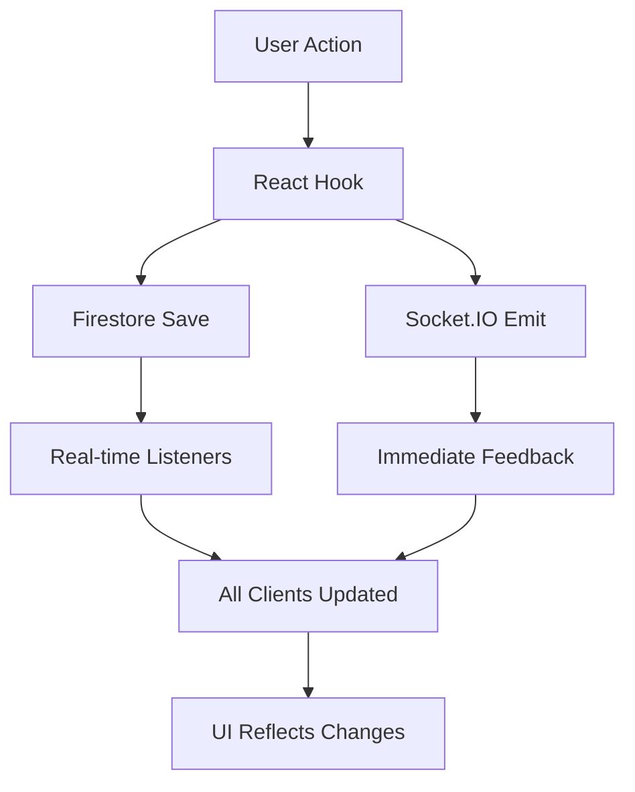

# 📦 Persistence & Recovery System

A comprehensive real-time draft persistence system with automatic state saving, recovery capabilities, and seamless reconnection handling.

## 🎯 Key Features

### ✅ **Automatic State Persistence**

- **Every pick is automatically saved** to Firestore in real-time
- **Draft state persisted** including current pick, round, turn order, timer status
- **Participant status tracking** with online/offline states and last activity
- **Queue management** with automatic cloud sync
- **Timer state persistence** so countdowns survive refreshes

### ✅ **Seamless Recovery**

- **Refresh without losing progress** - all state recovered from Firestore
- **Disconnect and reconnect** without breaking the draft flow
- **Late joiners can sync** from the current saved state
- **Automatic reconnection** with exponential backoff
- **State validation** to ensure data integrity

### ✅ **Real-Time Synchronization**

- **Firestore real-time listeners** for instant updates across all clients
- **Socket.IO integration** for immediate feedback and responsiveness
- **Dual-layer sync** combining WebSocket speed with Firestore reliability
- **Conflict resolution** with server-side state as the source of truth

## 🏗️ Architecture

### Core Components

1. **`DraftPersistenceService`** (`/src/services/draftPersistence.ts`)
   - Firestore integration for draft state management
   - Real-time subscriptions and updates
   - Pick saving and participant management
   - Recovery and sync operations

2. **`usePersistentDraft`** (`/src/hooks/usePersistentDraft.ts`)
   - React hook for persistent draft state
   - Automatic loading and real-time updates
   - Action methods with built-in persistence
   - Error handling and recovery

3. **Socket.IO Server** (`/socketio-server.ts`)
   - Real-time WebSocket communication
   - Immediate feedback for user actions
   - Timer management and countdown sync
   - Participant presence tracking

### Data Flow



## 🚀 Usage

### Basic Implementation

```typescript
import { usePersistentDraft } from '@/hooks/usePersistentDraft';

function DraftRoom({ draftId, currentUserId }: { draftId: string; currentUserId: string }) {
  const {
    // State
    draftState,
    isLoading,
    error,
    lastSyncTime,
    recentActivity,

    // Actions
    makePick,
    updateQueue,
    forceSync,
    recoverDraftState
  } = usePersistentDraft({ draftId, currentUserId });

  // Handle pick with automatic persistence
  const handlePlayerSelection = async (playerId: string, playerName: string) => {
    try {
      await makePick(playerId, playerName, 'MID', 'Team FC');
      // Pick is automatically saved to Firestore and broadcast to all participants
    } catch (error) {
      console.error('Failed to make pick:', error);
    }
  };

  // Update queue with automatic sync
  const handleQueueUpdate = async (newQueue: string[]) => {
    try {
      await updateQueue(newQueue);
      // Queue is automatically saved and synchronized
    } catch (error) {
      console.error('Failed to update queue:', error);
    }
  };

  if (isLoading) return <LoadingSpinner />;
  if (error) return <ErrorRecovery onRecover={recoverDraftState} />;
  if (!draftState) return <DraftNotFound onRetry={forceSync} />;

  return (
    <div className="draft-room">
      {/* Connection status */}
      <ConnectionStatus
        isConnected={!!lastSyncTime}
        lastSync={lastSyncTime}
      />

      {/* Draft state display */}
      <DraftHeader
        draftName={draftState.name}
        currentPick={draftState.currentPick}
        currentRound={draftState.currentRound}
        timeRemaining={draftState.timeRemaining}
      />

      {/* Player selection */}
      <PlayerGrid onSelectPlayer={handlePlayerSelection} />

      {/* Queue management */}
      <QueueManager
        currentQueue={getCurrentUserQueue(draftState, currentUserId)}
        onUpdateQueue={handleQueueUpdate}
      />

      {/* Recent activity feed */}
      <ActivityFeed activities={recentActivity} />
    </div>
  );
}
```

### Advanced Recovery Scenarios

```typescript
// Manual recovery for connection issues
const handleConnectionIssue = async () => {
  try {
    // Force sync from Firestore
    await forceSync();
    console.log('✅ Successfully recovered draft state');
  } catch (error) {
    console.error('❌ Recovery failed:', error);
    // Fallback to full state recovery
    await recoverDraftState();
  }
};

// Late joiner sync
const handleLateJoiner = async (participantId: string) => {
  try {
    const summary = await draftPersistence.getDraftSummary(draftId);
    if (summary) {
      console.log(`📊 Draft summary for late joiner:`, summary);
      // Show catch-up interface with current state
    }
  } catch (error) {
    console.error('Failed to get draft summary:', error);
  }
};
```

## 🔧 Configuration

### Environment Setup

```bash
# Required environment variables
NEXT_PUBLIC_FIREBASE_API_KEY=your_api_key
NEXT_PUBLIC_FIREBASE_PROJECT_ID=your_project_id
NEXT_PUBLIC_FIREBASE_AUTH_DOMAIN=your_domain
# ... other Firebase config
```

### Firestore Security Rules

```javascript
rules_version = '2';
service cloud.firestore {
  match /databases/{database}/documents {
    // Draft documents
    match /drafts/{draftId} {
      // Allow read access to all authenticated users
      allow read: if request.auth != null;

      // Allow write access to draft participants
      allow write: if request.auth != null
        && request.auth.uid in resource.data.participants[].id;
    }
  }
}
```

### Start Development Servers

```bash
# Start both Next.js and Socket.IO servers
npm run dev:full

# Or start individually
npm run dev      # Next.js on port 3000
npm run socket   # Socket.IO on port 3002
```

## 📊 State Management

### Draft State Structure

```typescript
interface DraftState {
  id: string;
  name: string;
  leagueSize: number;
  draftType: 'snake' | 'linear';
  status: 'PENDING' | 'LIVE' | 'PAUSED' | 'COMPLETED';
  currentPick: number;
  currentRound: number;
  currentTurn: number; // 0-based participant index
  timeRemaining: number;
  timerActive: boolean;
  participants: DraftParticipant[];
  picks: DraftPick[];
  createdAt: FirestoreTimestamp;
  updatedAt: FirestoreTimestamp;
  lastActivity: FirestoreTimestamp;
  settings: {
    pickTimeLimit: number;
    allowTrades: boolean;
    autoPickEnabled: boolean;
  };
}
```

### Pick Structure

```typescript
interface DraftPick {
  id: string;
  overall: number; // Overall pick number (1-264)
  round: number; // Round number (1-22)
  slot: number; // Position in round (1-12)
  player: {
    id: string;
    name: string;
    position: string;
    club: string;
  };
  member: {
    id: string;
    displayName: string;
  };
  auto: boolean; // Was this an auto-pick?
  madeAt: string; // ISO timestamp
  timestamp: FirestoreTimestamp;
}
```

## 🛠️ Error Handling

### Automatic Recovery Strategies

1. **Connection Loss**
   - Automatic reconnection with exponential backoff
   - Firestore offline persistence maintains local state
   - Sync resolution when connection restored

2. **State Conflicts**
   - Server state always wins in conflicts
   - Client state merged with server updates
   - User notified of any discrepancies

3. **Pick Validation**
   - Server-side validation prevents invalid picks
   - Client immediately updates, server confirms
   - Rollback if server rejects the pick

4. **Timer Synchronization**
   - Regular timer updates from server
   - Client prediction with server correction
   - Pause/resume functionality for disruptions

## 🎯 Benefits

### For Users

- **Never lose progress** from browser refreshes or connection issues
- **Seamless experience** when switching devices or networks
- **Real-time updates** see picks instantly as they happen
- **Reliable drafting** even with unstable connections

### For Developers

- **Simple integration** with existing components
- **Automatic state management** no manual sync required
- **Comprehensive error handling** built-in recovery strategies
- **Scalable architecture** supports multiple concurrent drafts

## 🔍 Monitoring & Debugging

### Console Logging

The system includes comprehensive logging:

- `📦` Firestore operations (initialization, saves, updates)
- `🔄` Real-time synchronization events
- `📡` Socket.IO connection status and events
- `✅` Successful operations and state changes
- `❌` Errors and recovery attempts

### Activity Tracking

Monitor draft activity in real-time:

```typescript
// Recent activity includes:
// - Pick made events
// - Participant join/leave
// - State recovery operations
// - Queue updates
// - Connection status changes

const { recentActivity } = usePersistentDraft({ draftId, currentUserId });

recentActivity.forEach((activity) => {
  console.log(`${activity.type}: ${activity.message} at ${activity.timestamp}`);
});
```

## 🚀 Production Deployment

### Firestore Optimization

- Use composite indexes for complex queries
- Implement field-level security rules
- Monitor read/write operations and costs
- Consider using Firestore bundles for initial state

### Performance Considerations

- WebSocket connection pooling for high concurrency
- Firestore offline persistence for mobile reliability
- CDN caching for static assets
- Database connection optimization

### Monitoring

- Set up Firestore monitoring and alerts
- Track WebSocket connection metrics
- Monitor draft completion rates and error rates
- User experience analytics for recovery events

---

## 📋 Quick Start Checklist

- [ ] ✅ Firebase project configured
- [ ] ✅ Firestore security rules deployed
- [ ] ✅ Environment variables set
- [ ] ✅ Development servers running (`npm run dev:full`)
- [ ] ✅ Test draft creation and persistence
- [ ] ✅ Verify recovery after browser refresh
- [ ] ✅ Test multi-user real-time sync

**Your Persistence & Recovery system is now fully operational!** 🎉

The system automatically saves every pick, maintains perfect sync across all participants, and ensures that no draft progress is ever lost due to disconnections or browser refreshes.
