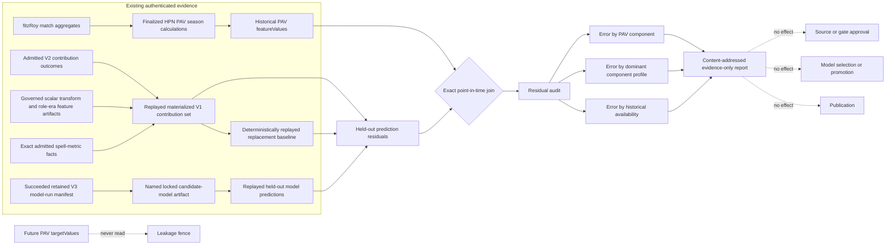

# AFL player Equity model feasibility

- Status: architecture research plus an implemented evaluation-only residual audit; no source or
  model authority is granted by this note
- Investigated: 2026-09-01
- Scope: whether Statly can reproduce or independently build an action-value model comparable to
  Champion Data Player Ratings or Wheelo Equity
- Governing boundaries: [AFL trade intelligence](afl-trade-intelligence.md) and
  [source-rights assessment](afl-trade-source-rights-assessment.md)

## Decision

Statly should **not attempt to reproduce Champion Data Player Ratings or Wheelo Equity from the
currently approved sources**. The public material explains the architecture, but neither the exact
modern parameters nor a licensed, ordered event feed containing location, possession phase, pressure,
action outcome and shared participants is available to this repository.

An independently specified event-value model is technically credible, but it is a **no-go until a new
source passes rights, representative-capture and completeness gates**. AFL Tables and Footywire are
standing-policy-eligible to support an independently named match-stat contribution surrogate, but no
execution is authorized until exact current Gate records, capture lineage and admission exist. That
surrogate is not Equity and must not be presented as expected-points-added.

This research does not amend the declared source, unit or model boundaries of issues
[#574](https://github.com/statlyaus/Statly/issues/574)–
[#579](https://github.com/statlyaus/Statly/issues/579). Statly action value is a separate future
source-and-model initiative. Wheelo outputs may become shadow validation evidence only after their
upstream lineage and permitted uses are reviewed; they are not a training-label workaround.

The safe immediate use of the already governed fitzRoy-derived HPN PAV calculation is narrower. The
module in `playerAggregateStatResidualAudit.ts` can inspect whether a locked admitted-player model's
held-out errors vary with historical offensive, midfield, defensive and total PAV per game or with
historical games per feature season. It does not add those quantities to training, change the target,
select a model, promote a run or publish a grade. Operational use still requires callers to supply the
exact authenticated admitted V2 source set, its materialized V1 contribution set, baseline fit,
prediction set, governing model protocol, exact spell-metric facts, retained scalar-transform and
point-in-time feature artifact bytes, the succeeded retained V3 model-run manifest, its named
candidate-model artifact, and the player-PAV observation set.

## Current evaluation calculation flow



The audit first authenticates the protocol's retained scalar-transform and point-in-time feature
artifact bytes, checks their dataset and role/era-definition bindings, and replays the executor's exact
materialization over the admitted spell-metric facts. The supplied V1 set must equal that
content-addressed replay. The audit then proves that the baseline and predictions bind the genuine V1
set, deterministically re-fits the baseline, authenticates the retained candidate model's exact
coefficients and ancestry, and verifies that the succeeded V3 model-run manifest names that model and
binds the same configuration, baseline, protocol and admitted source set. The supplied prediction set
must equal a held-out replay. The PAV join requires the same source-native player,
receiving acquisition-spell
identifier and spell-version identifier, held-out partition, and the PAV prediction season immediately
preceding the contribution season. The PAV cutoff must not exceed the contribution cutoff, and every
PAV feature value must have been effective and calculated by the contribution feature boundary.
Duplicate exact matches, late calculations and incomplete prediction coverage fail closed. Missing or
partial PAV history is an explicit exclusion, and the declared minimum comparable count must still be
met.

The audit reports candidate and games-only mean absolute error and mean signed error for five
historical features: offensive, midfield, defensive and total PAV per game, plus games per feature
season. With adequate support and variance it also reports Pearson relationships between each feature
and signed or absolute residuals. It groups the same errors by the player's dominant historical PAV
component (`offensive`, `midfield`, `defensive` or `mixed`). Small or constant samples produce an
explicit `insufficient_support` or `no_variance` status rather than a manufactured coefficient.

This is the implemented first lane for learning from available aggregate data. Adding PAV features to
training remains a separate protocol and source-authority decision because the current reviewed HPN
receipts permit private calculation, not model training.

## 1. Keep the quantities separate

| Quantity               | Question answered                                                                     | Grain                         | Status in Statly             |
| ---------------------- | ------------------------------------------------------------------------------------- | ----------------------------- | ---------------------------- |
| Match action value     | How much did recorded actions change expected next-score value?                       | action summed to player-match | future research              |
| Player ability         | What repeatable skill does the player possess independent of opportunity?             | latent/player-time            | not directly observed        |
| Future contribution    | How much contribution will the player produce after the prediction cutoff?            | acquisition spell             | current governed estimand    |
| Trade value            | What is that future contribution worth given contract, age, list and counterfactuals? | transaction option            | downstream decision quantity |
| Official Rating Points | Champion Data's proprietary action-value output for a match                           | player-match                  | external modeled field       |
| Wheelo Equity          | Wheelo's reconstruction and decomposition of the action-value idea                    | player-match/period           | external modeled output      |

The current admitted-player contract uses `games`, `goals`, `brownlow_votes` and `coaches_votes` to
construct an acquisition-spell contribution target, then predicts contribution above a role/era
replacement level from point-in-time features
(`src/server/aflTradeIntelligence/modeling/playerContributionContracts.ts` and
`src/server/aflTradeIntelligence/modeling/admittedPlayerContributionCandidate.ts`). Replacing that
target with action value would be a new outcome definition and protocol version, not a weight change.

## 2. What the public record establishes

### Observed

- The AFL describes Player Ratings as assigning positive or negative value to actions according to
  their effect on the team's chance of the next score. The match total is then transformed into a
  longer-horizon ranking. The public descriptions disagree about the historical rolling weights, so
  even that ranking layer requires an explicit method version. See the AFL
  [FAQ](https://www.afl.com.au/news/453167/player-ratings-frequently-asked-questions) and
  [methodology PDF](https://s.afl.com.au/staticfile/AFL%20Tenant/AFL/PlayerRatings/PlayerRatings_HOW.pdf).
- Karl Jackson's thesis specifies the original research model in detail: signed next-score value,
  spatial and possession-phase state, smoothed state estimates, event-by-event changes and explicit
  shared-credit rules. The thesis is available from the
  [Swinburne research repository](https://doi.org/10.25916/sut.26294677.v1) and is marked in
  copyright; this note paraphrases its method and does not reproduce its text or data.
- Wheelo says its `Player Rating` is the official measure and describes `Equity` as its own
  implementation. Its public AFL statistics page separates Pre Clearance, Post Clearance, Ball
  Winning and Ball Use, with Ball Use including disposal, shots and carrying. See Wheelo's
  [methodology](https://www.wheeloratings.com/afl_methodology.html) and
  [player statistics](https://www.wheeloratings.com/afl_stats.html?comp=afl&season=2021).
- Wheelo's [public site repository](https://github.com/whelanandrew83/whelanandrew83.github.io)
  contains generated JSON and display/load code with Rating and Equity fields. It contains no located
  training corpus, fitted state parameters or complete scoring implementation, and declares no
  repository licence.

### Strongly inferred

- Wheelo uses Champion Data identifiers and displays Champion Data Rating Points alongside its own
  Equity fields. This supports a Champion Data lineage inference but does not prove which raw inputs,
  corrections or method version produced every field.
- The original thesis is the best public architectural specification, not proof of the exact modern
  Champion Data or Wheelo implementation. Both may have changed state definitions, coefficients and
  allocation policy.

### Unknown

- Modern fitted probabilities, smoothing choices, priors, shrinkage and recalibration schedule.
- Exact definitions and encodings for every action, pressure level, possession phase and chain.
- Wheelo's complete input feed, source rights, missing-data policy, calculation code and revisions.
- Historical completeness, correction policy and stable licensing for any public output snapshot.

Public visibility is not permission to retain, train on, distil or redistribute the data. fitzRoy's
MIT licence covers package code, not AFL, Champion Data or Wheelo data rights.

## 3. Independent event-model specification

This is an implementable _independent_ design, not a claim to reproduce either provider.

### State and target

For ordered event `i` and fixed focal team `f`, define a state:

`x_i(f) = (focal possession relation, oriented location, possession phase, pressure, restart context, match context)`

and a signed next-score target:

`y_i(f) in {-6, -1, 0, 1, 6}`

where the sign remains positive for the focal team's next score and negative for its opponent's,
regardless of which side has possession. Zero means no later score before the defined terminal
boundary. Fit a chronologically partitioned model that emits calibrated probabilities for all five
outcomes and their expected value: `V_f(x) = E[y(f) | x(f)]`. An action's raw transition is:

`delta_i(f) = V_f(x_(i+1)) - V_f(x_i)`

Both states use the same focal team, so a turnover does not reverse the perspective between terms.
Terminal scores use their scoreboard value; a behind transition must also account for the resulting
opposition kick-in state. The complete state schema, terminal horizon, field-orientation and
perspective rules are part of the versioned protocol, not informal preprocessing.

### Minimum source record

Every admitted record needs match/event order, clock and period; acting and possession teams; player
and shared participants; action type/subtype; start and end coordinates; possession phase before and
after; pressure level and pressure actors; intended and actual disposal outcome; shot outcome; chain
and contest identity; turnover/error attribution; restart type; next event and next score; source
revision; and immutable lineage to the retained raw record.

Missing required state must fail closed. Imputing unavailable locations, participants or outcomes
would silently redefine the estimand. Tracking-derived off-ball value is a separate later model;
Statly action value must disclose that it measures recorded direct action rather than complete player
value.

### Allocation policy

Allocation is a separately versioned policy `A`, because shared responsibility is judgment rather
than learned fact. A faithful starting policy, adapted from the thesis, is:

| Event                  | Initial allocation rule                                                              |
| ---------------------- | ------------------------------------------------------------------------------------ |
| Disposal               | actor receives outcome-state minus pressure-adjusted start-state value               |
| Goal / behind          | shooter receives terminal transition, including kick-in consequence for a behind     |
| Contested win          | winner receives contest-state to possession-state change                             |
| Uncontested possession | zero unless it is an intercept or completes another shared action                    |
| Uncontested intercept  | split transition 50/50 between interceptor and opposition disposer                   |
| Mark on a lead         | split transition 50/50 between kicker and marker                                     |
| Hitout to advantage    | split 2/3 ruck, 1/3 receiver; reverse for a sharked hitout; neutral is zero          |
| Free kick              | split positive/negative transition 50/50 between recipient and conceder              |
| Effective spoil        | split with the teammate winning the next possession; otherwise retain contest change |
| Pressure / tackle      | allocate only the specified share of the prevented or forced transition              |
| Run / carry            | telescope value between possession and disposal locations                            |
| Error                  | actual outcome minus the declared expected uncontested/set-position outcome          |

Each transition is allocated once. Component labels should be versioned and exhaustive; a sensible
first set is `ball_winning`, `ball_use`, `pressure_defence`, `ruck_contest`, `discipline_error` and
`unallocated_residual`, with clearance phase as a separate context dimension. Do not force the total
to match Wheelo's component labels or numbers.

### Small module boundary

```ts
interface PlayerActionValueModel {
  fit(input: AdmittedHistoricalEventCorpus, protocol: StateModelProtocol): ActionValueModelArtifact;
  score(
    stream: AdmittedMatchEventStream,
    model: ActionValueModelArtifact,
    policy: AllocationPolicy
  ): PlayerMatchActionValueResult;
}
```

The artifact binds source-member hashes, partitions, state schema, target/horizon, fitted parameters,
calibration, software build and diagnostics. The result binds event inputs, model and policy hashes;
contains signed player totals, exhaustive components, uncertainty and an unallocated residual; and is
replayable without network access.

The versioned uncertainty contract consists of the five calibrated next-score probabilities at each
state plus median, 80% and 95% intervals for each event, component and player-match total. Produce the
intervals by refitting and rescoring whole-match or whole-round block-bootstrap samples so correlated
events are never treated as independent; aggregate a player-match total within each replicate before
taking quantiles. Record the seed, blocks, replicate count and interval definition. On held-out future
matches, report multiclass Brier and log loss, class calibration, and empirical 80%/95% interval
coverage. Acceptance thresholds must be locked in the protocol before `final_test`.

Required tests cover deterministic replay, chronological no-leakage, team-perspective sign reversal,
telescoping transitions, allocation fractions summing to one, no double counting, player/team/event
reconciliation, score-terminal handling, correction versioning and rejection of missing required
state. Validation must compare against location-only and possession-volume baselines on untouched
future seasons, with calibration, error, stability and role/team/era subgroups reported. `final_test`
is evaluated once after candidate and allocation-policy lock.

## 4. Source feasibility and rights

| Source lane                 | What it supplies                                                  | Event model?                                        | Permitted action now                                  |
| --------------------------- | ----------------------------------------------------------------- | --------------------------------------------------- | ----------------------------------------------------- |
| AFL Tables through fitzRoy  | player-match totals and match context                             | No: no ordered actions, location, phase or pressure | use only under exact current approved purpose records |
| Footywire through fitzRoy   | player-match totals                                               | No                                                  | same standing-policy constraints                      |
| Official AFL player stats   | match aggregates including `ratingPoints` in the inspected schema | No; also no current training authority              | no-go pending Gate 0A and 0B                          |
| Official AFL score worm     | score events and time, not the intervening action chain           | No                                                  | no-go; cannot reconstruct transitions                 |
| Wheelo public output        | player Rating/Equity aggregates and components                    | No raw event state or reproducible implementation   | conceptual comparison only pending rights             |
| New licensed event provider | potentially the complete event record                             | Yes, if schema and coverage pass                    | future Gate 0A/0B proposal required                   |

Gate 0A must resolve access, raw and normalized retention, training, derived artefacts, commercial use,
publication, attribution, correction/withdrawal and deletion. Gate 0B must use a quarantined
representative capture to prove schema, event order, match and appearance completeness, coordinate and
phase coverage, participant links, null semantics, ID stability, corrections and replay. A source that
passes only one gate remains a no-go.

## 5. Three implementation lanes

| Lane                                    | Product claim                                                  | Feasibility                                                      | Decision                        |
| --------------------------------------- | -------------------------------------------------------------- | ---------------------------------------------------------------- | ------------------------------- |
| Exact Champion Data/Wheelo reproduction | same rating or Equity                                          | parameters, rules, data and rights are unavailable               | **NO-GO**                       |
| Independent event approximation         | Statly-defined expected next-score action value                | technically sound after a licensed complete event feed           | **DEFER / GATED**               |
| Match-stat contribution surrogate       | predictive contribution derived from admitted match aggregates | eligible after exact current Gate records, capture and admission | **GATED; never call it Equity** |

The surrogate can improve the existing target or features only through a separately named,
chronologically validated protocol. It cannot infer where an action occurred, which state changed or
who shared credit. Success is better held-out prediction of Statly's declared trade decision, not
correlation with a proprietary rating.

## 6. Boundary with #574–#579

The current issue sequence governs the existing player-and-pick evidence loop. This assessment does
not add Wheelo, Rating Points, action-value events or a new target to that loop, and it does not alter
the current units or schemas. Any future Statly action-value initiative must begin independently at
the normal source-rights and representative-capture gates before it can define a model protocol.

The practical answer is therefore: Statly can build a defensible independent action-value model, and
could eventually outperform public alternatives for its own trade decisions, but cannot honestly
claim a comparable implementation from today's data. Model training is the later step; acquiring an
authorized, replayable event truth is the immediate prerequisite.
